<picture>
  <source
    media="(prefers-color-scheme: dark)"
    srcset="https://terminal-identity-opal.vercel.app/api?name=Karan%20Kashyap&username=areyoukaran&role=Backend%20Engineer%20&tagline=Building%20backend%20systems%20that%20power%20AI&theme=obsidian/graphite&pattern=grid&motion=scan&width=1200&height=460&v=3"
  />
  <source
    media="(prefers-color-scheme: light)"
    srcset="https://terminal-identity-opal.vercel.app/api?name=Karan%20Kashyap&username=areyoukaran&role=Backend%20Engineer%20&tagline=Building%20backend%20systems%20that%20power%20AI&theme=obsidian/graphite&pattern=grid&motion=scan&width=1200&height=460&v=3"
  />
  
</picture>

 

&nbsp;

&nbsp;

&nbsp;

  

 

SQLAlchemy · Pydantic · AsyncIO · JWT · OAuth 2.0 · pgvector · LangGraph · RAG · Hugging Face · LLM Evaluation · GitHub Actions · pytest

  

<picture>
  <source
    media="(prefers-color-scheme: dark)"
    srcset="./assets/cadence.dark.svg"
  />
  
</picture>

  

<picture>
  <source
    media="(prefers-color-scheme: dark)"
    srcset="https://raw.githubusercontent.com/areyoukaran/areyoukaran/output/github-snake-dark.svg"
  />
  <source
    media="(prefers-color-scheme: light)"
    srcset="https://raw.githubusercontent.com/areyoukaran/areyoukaran/output/github-snake.svg"
  />
  
</picture>

